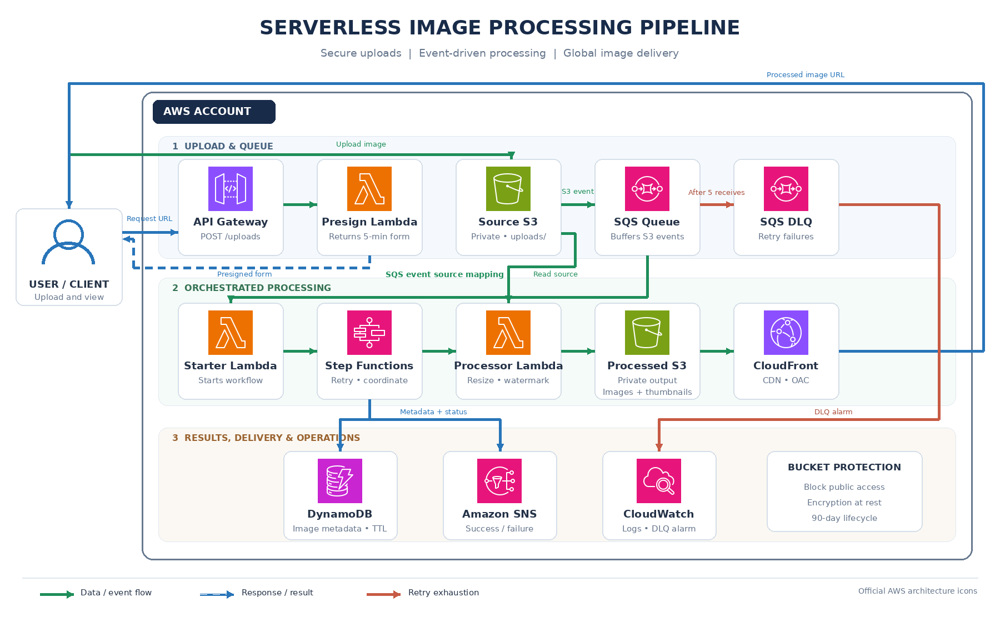
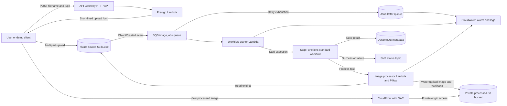

# Serverless Image Processing Pipeline

Graduation project for AWS Solutions Architect - Associate. The system accepts a short-lived upload form, stores the original image privately, queues the S3 event, and processes it through a Step Functions workflow. The workflow saves watermarked images and thumbnails, records metadata, and makes completed images available through CloudFront.

## Architecture



Download the [architecture diagram (PNG)](docs/architecture.png). The image uses official icons from the [AWS Architecture Icons package](https://aws.amazon.com/architecture/icons/). Its editable Mermaid source is also available as [`architecture.mmd`](architecture.mmd).



CloudFront serves only processed images and thumbnails; both S3 buckets block public access.

## What it does

- Creates a five-minute S3 upload form through API Gateway. Uploads are limited to JPEG and PNG files up to 10 MiB.
- Sends `uploads/` object-created events from S3 to SQS. Failed dispatch messages retry and move to a dead-letter queue after five receives.
- Uses Step Functions to run image processing, save metadata to DynamoDB, and publish completion or failure messages to SNS.
- Resizes images to fit within 1200 x 1200 pixels, adds the `AWS SAA Graduation Project` watermark, and creates a 320 x 320 thumbnail.
- Serves processed images through CloudFront with Origin Access Control. Source and output objects expire after 90 days.

## AWS resources

| Area | Resources | Purpose |
| --- | --- | --- |
| Upload | API Gateway, presign Lambda, private S3 bucket | Issue restricted temporary upload forms and store originals |
| Buffering | SQS queue, dead-letter queue | Decouple uploads from processing and retain repeatedly failing dispatch messages |
| Workflow | Starter Lambda, Step Functions, image processor Lambda | Start, retry, and coordinate each processing job |
| Results | Private S3 bucket, DynamoDB, SNS | Store outputs, searchable metadata, and workflow notifications |
| Delivery | CloudFront, Origin Access Control | Cache and serve processed images without public S3 access |
| Operations | CloudWatch logs, DLQ alarm, Lambda tracing | Inspect executions and identify failed jobs |

## Repository layout

```text
.
├── README.md
├── architecture.mmd
├── template.yaml
├── assets/
│   └── aws-icons/
├── docs/
│   ├── architecture.png
│   └── presentation-guide.md
├── scripts/
│   ├── render_architecture.py
│   └── upload_image.py
└── src/
    ├── dispatch.py
    ├── presign.py
    ├── process.py
    └── requirements.txt
```

## Deploy

Prerequisites: an AWS account, AWS CLI credentials with permission to create the listed resources, AWS SAM CLI, Docker for the container build, and Python 3.10 or later for the demo script.

```bash
sam build --use-container
sam deploy --guided --stack-name image-pipeline --capabilities CAPABILITY_IAM
```

Choose a lowercase, globally unique `BucketNameSuffix` when prompted. CloudFront distribution creation can take several minutes. The deployment outputs include the API URL, source and output bucket names, queue and DLQ names, state machine ARN, metadata table, SNS topic, and CloudFront domain.

## Try it

Copy the `UploadApiUrl` output, then upload a local JPEG or PNG:

```bash
python3 scripts/upload_image.py 'https://API_ID.execute-api.REGION.amazonaws.com/uploads' ./sample.jpg
```

The script requests a temporary form from API Gateway and submits the image to S3. It prints the generated source object key. The workflow then produces:

- `processed/<filename>`: resized image with watermark.
- `thumbnails/<filename>`: smaller watermarked preview.
- A DynamoDB item containing source and output keys, dimensions, CloudFront URLs, status, and expiry time.

Inspect Step Functions executions, the Lambda log groups, the SQS dead-letter queue, and the DynamoDB item in the AWS console. The SNS topic is created for success and failure messages; subscribe an email address in the console if you want to receive them.

## Security notes

- The upload API is public and rate-limited. It does not authenticate individual users; the returned S3 form is restricted to an allowed image type, the `uploads/` prefix, a 10 MiB maximum, and a five-minute expiry.
- Both buckets block public access and use S3-managed encryption. CloudFront uses Origin Access Control to read only processed image prefixes.
- Processed images are publicly viewable through the CloudFront URL. Use sample images only; do not upload private or sensitive photos.
- S3 lifecycle rules remove original and processed objects after 90 days. DynamoDB metadata uses a matching TTL.

## Clean up

Empty both buckets before deleting the stack. Use the bucket names from the stack outputs:

```bash
aws s3 rm s3://UPLOADS_BUCKET_NAME --recursive
aws s3 rm s3://PROCESSED_BUCKET_NAME --recursive
sam delete --stack-name image-pipeline
```

The stack also creates an API, queues, Lambdas, a state machine, a DynamoDB table, an SNS topic, CloudWatch resources, and a CloudFront distribution. Check the AWS console after deletion to confirm the stack and distribution are removed.

## Submission and presentation

The course handout's required deliverables are an architecture diagram and a public GitHub repository with the project documentation in this README. The diagram is provided as a PNG using official AWS service icons. A deployed URL or recorded demo is optional but encouraged. See [`docs/presentation-guide.md`](docs/presentation-guide.md) for a short walkthrough and review checklist.

## Scope

This is an educational implementation of the graduation-project idea, organized with a solution-style overview and architecture documentation. It is separate from the linked AWS dynamic-image-transformation solution, which solves a different use case. The architecture includes the project idea's core upload, queue, orchestration, processing, metadata, notification, and delivery services.
