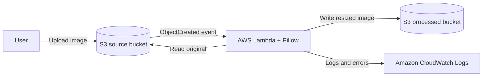

# Serverless Image Processing Pipeline

AWS Solutions Architect - Associate graduation project. Upload an image to a private Amazon S3 bucket; an S3 event invokes AWS Lambda, which validates and resizes the image before saving it to a separate private S3 bucket.

## Architecture



The source and destination buckets are private and block public access. The Lambda execution role can read from the source bucket and write to the destination bucket only. Processed objects use a `processed/` prefix and are ignored by the trigger to prevent recursive invocations.

## What it does

- Accepts JPEG and PNG images up to 10 MiB.
- Validates the image contents and resizes it to fit within 1200 x 1200 pixels while preserving its aspect ratio.
- Saves the result under the same object key in the destination bucket, preserving the image format.
- Emits processing errors to CloudWatch Logs for troubleshooting.

## Project files

```text
.
├── README.md
├── architecture.mmd
├── template.yaml
└── src/
    ├── app.py
    └── requirements.txt
```

## Deploy

Prerequisites: an AWS account, AWS CLI configured with credentials, and AWS SAM CLI. Deploy in a region that supports AWS Lambda Python 3.12.

```bash
sam build --use-container
sam deploy --guided --stack-name image-pipeline
```

When prompted, review the changeset and confirm the deployment. The template creates two S3 buckets, one Lambda function, and its IAM role. Keep the generated bucket names from the deployment outputs.

## Try it

Upload a local JPEG or PNG using the source bucket name from the stack outputs:

```bash
aws s3 cp ./sample.jpg s3://SOURCE_BUCKET_NAME/uploads/sample.jpg
```

After the event is processed, retrieve the resized image from the destination bucket:

```bash
aws s3 cp s3://PROCESSED_BUCKET_NAME/processed/uploads/sample.jpg ./sample-resized.jpg
```

Check the Lambda log group `/aws/lambda/image-pipeline-image-processor` if an upload fails.

## Clean up

Empty both buckets, then delete the stack so that no project resources remain:

```bash
aws s3 rm s3://SOURCE_BUCKET_NAME --recursive
aws s3 rm s3://PROCESSED_BUCKET_NAME --recursive
sam delete --stack-name image-pipeline
```

## Design decisions

- **Event-driven:** S3 invokes Lambda only when a source object is created; no server runs while idle.
- **Separate buckets:** Originals and processed files have separate storage boundaries.
- **Least privilege:** The function receives read access to the source bucket and write access to the destination bucket.
- **Recursion protection:** Only source objects outside the `processed/` prefix trigger the function.
- **Input limits:** The handler rejects oversized or unsupported files before processing.

## Possible extensions

Add SQS with a dead-letter queue for buffering and retries, DynamoDB for job status and image metadata, Step Functions for multi-step workflows, and CloudFront for global image delivery. These are extensions beyond this small deployable baseline.

## Submission checklist

- [x] Architecture diagram included in the README and as `architecture.mmd`.
- [x] Public-repository-ready source and deployment template.
- [ ] Deploy to your AWS account and capture a successful upload and processed output.
- [ ] Create a public GitHub repository and add its URL to the course submission form.
- [ ] Optionally attach a short demonstration video or live URL.

## License

This project is provided for educational use. Add your preferred license before publishing if your course requires one.
